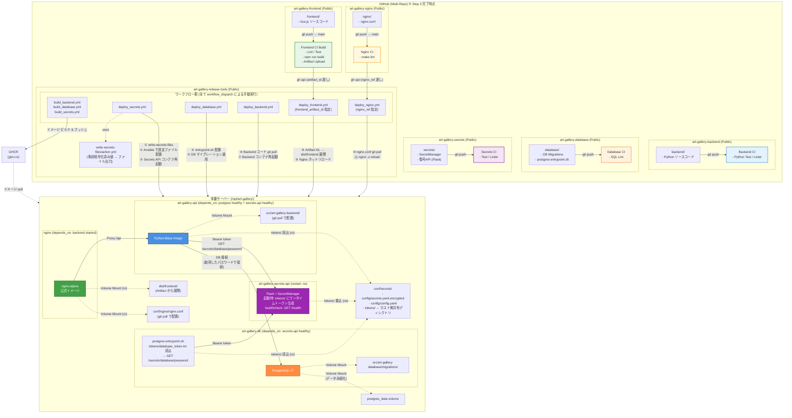

# art-gallery-release-tools

  

このリポジトリは、プロジェクト全体のインフラ構築、デプロイ、およびリリース管理を担う中央ハブです。

## 概要

マルチレポ構成における各コンポーネント（Backend, Frontend, Nginx, Database, Secrets API）を統合し、Ansible および GitHub Actions を用いて一貫性のあるデプロイ環境を提供します。

## 重要なドキュメント

- **[機密情報・暗号化運用ガイド](ansible/vault/README.md)**: GitHub Secrets を活用した事前暗号化フロー、および機密情報配布専用コンテナ（Secrets API）のライフサイクルについての詳細。

## 特徴

- **事前暗号化シークレット (Pre-encrypted Secrets)**: 機密情報は事前に Fernet で暗号化され、GitHub Actions Secrets から直接デプロイされます。CI は暗号化済みの値をそのままファイルに書き出すだけのシンプルなフローを採用しています。
- **Ephemeral Secrets（使い捨て機密情報配布）**: データベースパスワード等の配布を専用コンテナ（`art-gallery-secrets-api`）に分離しています。コンテナ起動時のワンタイムトークンを用いた認証を経て各サービスにパスワードを配布後、コンテナ自身が自動停止することでセキュリティリスクを最小化しています。
- **イメージとコードの分離**: Docker イメージには実行環境（OS・ミドルウェア）のみを内包し、アプリケーションコードはデプロイ時にボリュームマウントで提供する設計を採用しています。
- **完全手動デプロイ**: 意図しない更新を防ぐため、すべてのデプロイ・ビルド処理は GitHub Actions の `workflow_dispatch` から手動で実行します。「イメージのみの更新」と「コードのみの反映」を独立してトリガー可能です。
- **集中依存関係管理**: 各アプリケーションの `Dockerfile` や `requirements.txt` などを本リポジトリで一元管理し、実行環境の整合性を保証します。

## 機密情報のデプロイフロー

1. **事前準備**: 管理者がローカルで `art-gallery-secrets` の `SecretManager` を用いてパスワードを Fernet 暗号化し、GitHub Secrets に `PROD_SECRET_KEY` と `PROD_DB_PASSWORD_ENCRYPTED` として登録します。
2. **デプロイ**: GitHub Actions の `write-secrets-files` アクションが、Secrets の値をそのまま `secrets.yaml.encrypted` および `config.yaml` として出力し、Ansible がサーバーへ配置します。
3. **実行時**: `secrets-api` コンテナが起動し、配布された暗号化ファイルを復号。各サービスへワンタイムトークン経由でパスワードを提供します。

## ディレクトリ構成

```
art-gallery-release-tools/
├── .github/
│   ├── actions/
│   │   └── write-secrets-files/  # カスタムアクション（GitHub Secrets → ファイル出力）
│   └── workflows/
│       ├── build_backend.yml     # イメージビルド（workflow_dispatch）
│       ├── build_database.yml
│       ├── build_nginx.yml       # nginx イメージ（nginx:alpine + entrypoint）
│       ├── build_secrets.yml
│       ├── deploy_backend.yml    # コード反映・コンテナ再起動（workflow_dispatch）
│       ├── deploy_database.yml
│       ├── deploy_secrets.yml
│       ├── deploy_frontend.yml        # Artifact 展開 + Nginx リロード（CI 自動トリガー）
│       ├── deploy_nginx.yml           # nginx.conf 更新 + Nginx リロード（手動）
│       ├── reload_nginx.yml           # Nginx ホットリロードのみ（手動）
│       └── setup_startup_service.yml  # サーバー再起動時の自動起動サービス設定（手動）
└── ansible/
    ├── group_vars/all.yml        # 全環境共通変数（デプロイパス、イメージ名等）
    ├── inventory/
    │   ├── production.yml        # 本番環境ホスト定義
    │   └── ci.yml                # CI 環境ホスト定義
    ├── playbook_build_*.yml           # ビルド用プレイブック（build_*）
    ├── playbook_deploy_*.yml          # デプロイ用プレイブック（deploy_*）
    ├── playbook_reload_nginx.yml      # Nginx ホットリロード専用
    ├── playbook_setup_startup_service.yml  # systemd 自動起動サービス設定
    ├── roles/
    │   ├── backend/
    │   │   ├── internal/         # Dockerfile, requirements.txt（イメージビルド用）
    │   │   ├── tasks/            # deploy.yml（git pull + コンテナ再起動）
    │   │   └── templates/        # config.yaml.j2（Ansible テンプレート）
    │   ├── database/
    │   │   ├── internal/         # Dockerfile.j2（イメージビルド用）
    │   │   └── tasks/            # deploy.yml, migrate.yml
    │   ├── secrets/
    │   │   ├── internal/         # Dockerfile, requirements.txt
    │   │   └── tasks/            # deploy.yml
    │   ├── frontend/
    │   │   └── tasks/            # deploy.yml（Artifact DL + 展開）
    │   ├── nginx/
    │   │   ├── internal/         # Dockerfile, entrypoint.sh（イメージビルド用）
    │   │   └── tasks/            # deploy.yml（git pull + reload） / reload.yml（reload のみ）
    │   └── docker/
    │       ├── tasks/            # deploy_compose.yml / setup_startup_service.yml
    │       └── templates/        # docker-compose.yml.j2 / startup.sh.j2 / art-gallery.service.j2
    ├── test_resources/           # CI テスト用リソース（inventory, playbook）
    └── vault/
        └── README.md             # 暗号化運用ガイド
```

## 全体構成図



---

### 構成の説明

#### リポジトリ構成

| リポジトリ | 公開 | 内容 |
|:---|:---:|:---|
| art-gallery-backend | Public | Python ソースコード |
| art-gallery-database | Public | DB マイグレーション、postgres-entrypoint.sh |
| art-gallery-secrets | Public | SecretManager、復号 API（Flask） |
| art-gallery-frontend | Public | Vue.js ソースコード（CI でビルド、Artifact 出力） |
| art-gallery-nginx | Public | nginx.conf（git pull でサーバーに配置） |
| art-gallery-release-tools | Public | Ansible Playbook、Dockerfile、ワークフロー |

#### ワークフロー（全て workflow_dispatch による手動実行）

- **ビルド**: `build_backend.yml` / `build_database.yml` / `build_secrets.yml` — 各コンポーネントの Docker イメージをビルドし GHCR にプッシュ
- **デプロイ**: `deploy_backend.yml` — Backend コードを git pull してコンテナを再起動  
  `deploy_database.yml` — postgres-entrypoint.sh を配置し DB マイグレーションを適用  
  `deploy_secrets.yml` — `write-secrets-files` アクションで設定ファイルを生成し Secrets API コンテナを再起動  
  `deploy_frontend.yml` — GitHub Artifact をダウンロードして `dist/frontend/` に展開後、Nginx をホットリロード  
  `deploy_nginx.yml` — `nginx.conf` を git pull で取得・配置し、`nginx -s reload` でホットリロード

※ `deploy_frontend.yml` / `deploy_nginx.yml` は各リポジトリの CI（`art-gallery-frontend` / `art-gallery-nginx`）が `gh api` 経由で自動トリガーする。

#### カスタムアクション

- **write-secrets-files/action.yml** — GitHub Secrets（`PROD_SECRET_KEY`、`PROD_DB_PASSWORD_ENCRYPTED`）を受け取り、`secrets.yaml.encrypted` / `config.yaml` をそのまま書き出す。暗号化・復号は行わない

#### サーバー上のコンテナ起動順序とデータフロー

起動順序は docker-compose の `depends_on` で制御される。

1. **art-gallery-secrets-api**（`restart: no`）が最初に起動  
   - マウントされた `conf/secrets/config/` の `secrets.yaml.encrypted` と `config.yaml` を読み込む  
   - 起動時に backend 用・database 用のワンタイムトークンを生成し、ホスト側の `conf/secrets/tokens/` に書き出す（rw マウント）  
   - ヘルスチェック: `GET /health` が通ると次のコンテナが起動可能になる  
   - パスワードを配布し終えたら自動停止（`restart: no`）

2. **art-gallery-db**（`depends_on: secrets-api healthy`）が起動  
   - `postgres-entrypoint.sh` が `tokens/database_token.txt` を読み込む（ro マウント）  
   - `GET /secrets/database/password`（Bearer トークン認証）でパスワードを取得  
   - 取得したパスワードを `POSTGRES_PASSWORD` に設定し公式 entrypoint を実行

3. **art-gallery-api**（`depends_on: postgres healthy` + `secrets-api healthy`）が起動  
   - `tokens/backend_token.txt` を読み込む（ro マウント）  
   - `GET /secrets/database/password` でパスワードを取得し DB 接続  
   - アプリケーションコードは `src/art-gallery-backend/`（git pull で配置、Volume Mount）

4. **nginx**（`depends_on: backend started`）が起動  
   - 公式イメージ（`nginx:alpine`）を使用。イメージのビルドは不要  
   - `conf/nginx/nginx.conf` を ro マウント（`deploy_nginx.yml` で更新・ホットリロード）  
   - `dist/frontend/` を ro マウントして静的ファイルを配信（`deploy_frontend.yml` で Artifact 展開）  
   - `/api` へのリクエストは `art-gallery-api` コンテナへリバースプロキシ

#### 設計上のポイント

- **復号の一元化**: 復号ロジックは `art-gallery-secrets` のみが保持。Backend / PostgreSQL は自前で復号しない
- **使い捨てトークン**: トークンは使用後に即削除。リプレイ攻撃を防止
- **コードとイメージの分離**: Docker イメージは実行環境のみ。アプリケーションコードは git pull または Artifact 展開でボリュームマウント
- **Nginx ゼロダウンタイム更新**: 設定変更は `nginx -s reload` によるホットリロードで適用。コンテナ再起動不要
- **CI 起点の自動デプロイ**: Frontend / Nginx は各リポジトリの CI が `gh api` で `deploy_*` ワークフローをトリガー。release-tools への直接アクセス不要
- **完全手動デプロイ**: 全デプロイは `workflow_dispatch`（手動トリガー）。意図しない更新を防止