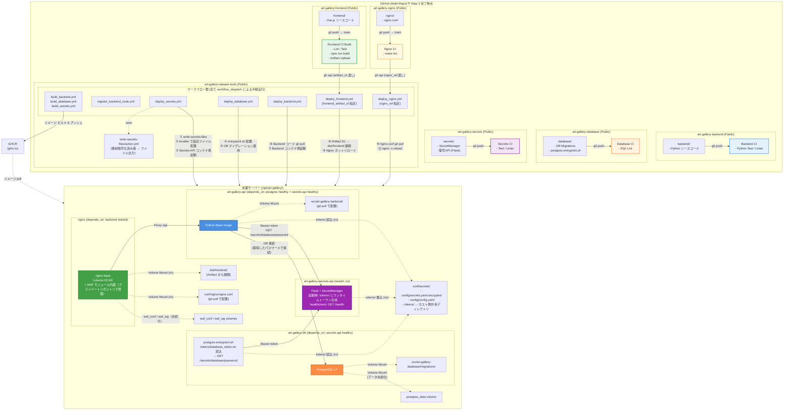

# art-gallery-release-tools

  

このリポジトリは、プロジェクト全体のインフラ構築、デプロイ、およびリリース管理を担う中央ハブです。

## 概要

マルチレポ構成における各コンポーネント（Backend, Frontend, Nginx, Database, Secrets API）を統合し、Ansible および GitHub Actions を用いて一貫性のあるデプロイ環境を提供します。

## 重要なドキュメント

- **[GitHub リポジトリ設定（Actions / PR 前提）](docs/GITHUB_REPOSITORY_SETUP.md)**: マニフェスト PR・デプロイ記録 PR を Actions で作成するために必要なリポジトリ設定。
- **[ビルド・デプロイとバージョン管理](BUILD_AND_DEPLOY.md)**: ビルド／デプロイ手順とマニフェストの役割・配置。
- **機密情報・暗号化運用**: Fernet 事前暗号化・ワンタイムトークン・Secrets API の手順と挙動は **art-gallery-secrets** リポジトリの README を参照。本リポジトリでの Actions / PR 前提の設定は **[GitHub リポジトリ設定（Actions / PR 前提）](docs/GITHUB_REPOSITORY_SETUP.md)**。

## 特徴

- **事前暗号化シークレット (Pre-encrypted Secrets)**: 機密情報は事前に Fernet で暗号化され、GitHub Actions Secrets から直接デプロイされます。CI は暗号化済みの値をそのままファイルに書き出すだけのシンプルなフローを採用しています。
- **Ephemeral Secrets（使い捨て機密情報配布）**: データベースパスワード等の配布を専用コンテナ（`art-gallery-secrets-api`）に分離しています。コンテナ起動時のワンタイムトークンを用いた認証を経て各サービスにパスワードを配布後、コンテナ自身が自動停止することでセキュリティリスクを最小化しています。
- **イメージとコードの分離**: Docker イメージには実行環境（OS・ミドルウェア）のみを内包し、アプリケーションコードはデプロイ時にボリュームマウントで提供する設計を採用しています。
- **完全手動デプロイ**: 意図しない更新を防ぐため、すべてのデプロイ・ビルド処理は GitHub Actions の `workflow_dispatch` から手動で実行します。「イメージのみの更新」と「コードのみの反映」を独立してトリガー可能です。
- **集中依存関係管理**: 各アプリケーションの `Dockerfile` や `requirements.txt` などを本リポジトリで一元管理し、実行環境の整合性を保証します。

## Backend のバージョン管理（マニフェスト）

Git タグではなく、**release-tools 上の YAML** でイメージタグとソースコミットの対応を集中管理します。

| ファイル | 内容 |
|:---|:---|
| `manifest/backend/image/backend_version_manifest.yml` | **イメージ**: タグ（キー）→ ビルド時の `source_ref` / `source_sha` / イメージ参照。`build_backend.yml` がビルド後に PR で追記。 |
| `manifest/backend/code/backend_code_manifest.yml` | **コード**: 論理バージョン（キー）→ デプロイ対象の `source_ref` / `source_sha`。`register_backend_code.yml` が PR で追記。 |
| `manifest/backend/deploy/backend_deploy_manifest.yml` | **本番デプロイ履歴**: `deploy_backend.yml` 成功後に追記（別 PR）。 |
| `manifest/frontend/image/frontend_version_manifest.yml` | **フロントビルド記録**: `build_frontend.yml` が PR で追記。 |
| `manifest/version_index.yml` | 上記マニフェストへのパス索引（人間・ツール向け）。 |

**推奨フロー**

1. イメージを切る: `build_backend.yml` → マニフェスト PR をマージ。
2. 本番コード版を固定する: `register_backend_code.yml`（`code_version` と `backend_ref`）→ マニフェスト PR をマージ。
3. `deploy_backend.yml` 実行時に `release_version`（イメージタグ）と、コード反映時は `code_version`（未指定なら `backend_ref` のみで `git` 取得。記録用 SHA は `git ls-remote` で解決）。

イメージデプロイ（`run_deploy_image`）では、`release_version` が **`manifest/backend/image/backend_version_manifest.yml` に存在する必要**があります（GitHub 上のタグは不要）。

## ポートフォリオ静的サイト（`/portfolio/`）

LP 等の静的ファイル用に、**Nginx デプロイとは独立した** `deploy_portfolio.yml` を用意しています。

- **URL**: `https://{domain_name}/portfolio/…`（例: `…/portfolio/1_asuka/`）。リポジトリルートをホストの `dist/portfolio` に同期し、コンテナはそれを `/usr/share/nginx/html/portfolio` にマウントします。ファイル更新のみで反映され、**nginx reload は不要**です。
- **Git**: デフォルトで `https://github.com/{{ github_owner }}/portfolio.git` を参照（`group_vars/all.yml` の `service_repo_names.portfolio`）。別リポジトリの場合はインベントリで `portfolio_github_owner` / `portfolio_github_repo` を上書きしてください。
- **GitHub Actions**: Secrets に `GH_TOKEN_PORTFOLIO`（`repo` 読み取りで十分な PAT）を登録し、`Deploy Portfolio` ワークフローを手動実行します。
- **初回（compose にボリューム追加後）**: `docker-compose.yml` の変更をサーバーに反映し、Nginx コンテナを**再作成**してください（例: 既存の nginx compose デプロイ手順）。その後はポートフォリオワークフローのみで更新可能です。

## 機密情報のデプロイフロー

1. **事前準備**: 管理者がローカルで `art-gallery-secrets` の `SecretManager` を用いてパスワードを Fernet 暗号化し、GitHub Secrets に `PROD_SECRET_KEY` と `PROD_DB_PASSWORD_ENCRYPTED` として登録します。
2. **デプロイ**: GitHub Actions の `write-secrets-files` アクションが、Secrets の値をそのまま `secrets.yaml.encrypted` および `config.yaml` として出力し、Ansible がサーバーへ配置します。
3. **実行時**: `secrets-api` コンテナが起動し、配布された暗号化ファイルを復号。各サービスへワンタイムトークン経由でパスワードを提供します。

## ディレクトリ構成

```
art-gallery-release-tools/
├── manifest/
│   ├── version_index.yml           # マニフェストファイルへのパス索引
│   ├── backend/
│   │   ├── image/backend_version_manifest.yml   # イメージタグ ↔ ソース SHA（build_backend）
│   │   ├── code/backend_code_manifest.yml       # コード版ラベル ↔ ソース SHA（register_backend_code）
│   │   └── deploy/backend_deploy_manifest.yml   # 本番デプロイ履歴（deploy_backend）
│   └── frontend/
│       └── image/frontend_version_manifest.yml  # フロントビルド記録（build_frontend）
├── .github/
│   ├── actions/
│   │   └── write-secrets-files/  # カスタムアクション（GitHub Secrets → ファイル出力）
│   └── workflows/
│       ├── build_backend.yml     # イメージビルド（workflow_dispatch）
│       ├── register_backend_code.yml  # コード版マニフェスト登録（workflow_dispatch）
│       ├── build_database.yml
│       ├── build_nginx.yml       # nginx アプリイメージ（nginx-base + entrypoint）。2層イメージ戦略のLayer 2
│       ├── build_secrets.yml
│       ├── deploy_backend.yml    # コード反映・イメージ更新（workflow_dispatch、マニフェスト参照）
│       ├── deploy_database.yml
│       ├── deploy_secrets.yml
│       ├── deploy_frontend.yml        # Artifact 展開 + Nginx リロード（CI 自動トリガー）
│       ├── deploy_nginx.yml           # nginx.conf 更新 + Nginx リロード / WAF初期設定（手動）
│       ├── deploy_portfolio.yml       # ポートフォリオ静的サイトのみ git pull（nginx reload なし・別タイムライン）
│       ├── reload_nginx.yml           # Nginx ホットリロードのみ（手動）
│       ├── update_waf_signatures.yml  # WAF シグネチャ手動更新（手動）
│       └── setup_startup_service.yml  # サーバー再起動時の自動起動サービス設定（手動）
└── ansible/
    ├── group_vars/all.yml        # 全環境共通変数（デプロイパス、イメージ名等）
    ├── inventory/
    │   ├── production.yml        # 本番環境ホスト定義
    │   └── ci.yml                # CI 環境ホスト定義
    ├── playbook_build_*.yml           # ビルド用プレイブック（build_*）
    ├── playbook_deploy_*.yml          # デプロイ用プレイブック（deploy_*）
    ├── playbook_reload_nginx.yml      # Nginx ホットリロード専用（コンテナ running 前提）
    ├── playbook_reload_nginx_safe.yml # 未起動なら compose up 後に reload（Frontend / CI 向け）
    ├── playbook_update_waf_signatures.yml  # WAF シグネチャ更新のみ
    ├── playbook_setup_startup_service.yml  # systemd 自動起動サービス設定
    ├── roles/
    │   ├── backend/
    │   │   ├── internal/         # Dockerfile, requirements.txt（イメージビルド用）
    │   │   ├── tasks/            # deploy.yml（git pull + コンテナ再起動）
    │   │   └── templates/        # config.yaml.j2（Ansible テンプレート）
    │   ├── database/
    │   │   ├── internal/         # Dockerfile.j2（イメージビルド用）
    │   │   └── tasks/            # deploy.yml, migrate.yml
    │   ├── secrets/
    │   │   ├── internal/         # Dockerfile, requirements.txt
    │   │   └── tasks/            # deploy.yml
    │   ├── frontend/
    │   │   └── tasks/            # deploy.yml（Artifact DL + 展開）
    │   ├── nginx/
    │   │   ├── internal/         # Dockerfile, entrypoint.sh（イメージビルド用）
    │   │   └── tasks/            # deploy.yml（git pull + reload） / reload.yml（reload のみ）
    │   ├── portfolio/
    │   │   └── tasks/            # deploy.yml（公開 portfolio リポジトリを dist/portfolio に git pull）
    │   └── docker/
    │       ├── tasks/            # deploy_compose.yml / setup_startup_service.yml
    │       └── templates/        # docker-compose.yml.j2 / startup.sh.j2 / art-gallery.service.j2
    └── test_resources/           # CI テスト用リソース（inventory, playbook）
```

## 全体構成図


```mermaid
graph TB
    subgraph GitHub_MultiRepo["GitHub (Multi-Repo) ※ Step 3 完了時点"]
        subgraph Backend_Repo["art-gallery-backend (Public)"]
            BA["backend/<br/>- Python ソースコード"]
            BA -->|"git push"| BAGHA_CI["Backend CI<br/>- Python Test / Linter"]
        end

        subgraph Database_Repo["art-gallery-database (Public)"]
            DBA["database/<br/>- DB Migrations<br/>- postgres-entrypoint.sh"]
            DBA -->|"git push"| DBGHA_CI["Database CI<br/>- SQL Lint"]
        end

        subgraph Secrets_Repo["art-gallery-secrets (Public)"]
            SEA["secrets/<br/>- SecretManager<br/>- 復号API (Flask)"]
            SEA -->|"git push"| SEGHA_CI["Secrets CI<br/>- Test / Linter"]
        end

        subgraph Frontend_Repo["art-gallery-frontend (Public)"]
            FEA["frontend/<br/>- Vue.js ソースコード"]
            FEA -->|"git push → main"| FEGHA_CI["Frontend CI Build<br/>- Lint / Test<br/>- npm run build<br/>- Artifact Upload"]
        end

        subgraph Nginx_Repo["art-gallery-nginx (Public)"]
            NGA["nginx/<br/>- nginx.conf"]
            NGA -->|"git push → main"| NGGHA_CI["Nginx CI<br/>- make lint"]
        end

        subgraph ReleaseTools_Repo["art-gallery-release-tools (Public)"]
            subgraph RT_Workflows["ワークフロー群 (全て workflow_dispatch による手動実行)"]
                RT_BUILD["build_backend.yml<br/>build_database.yml<br/>build_secrets.yml"]
                RT_REG_CODE["register_backend_code.yml"]
                RT_DEP_B["deploy_backend.yml"]
                RT_DEP_D["deploy_database.yml"]
                RT_DEP_S["deploy_secrets.yml"]
                RT_DEP_FE["deploy_frontend.yml<br/>(frontend_artifact_id 指定)"]
                RT_DEP_NG["deploy_nginx.yml<br/>(nginx_ref 指定)"]
            end
            RT_ACT_WRITE["write-secrets-files/action.yml<br/>(事前暗号化済み値 → ファイル出力)"]
        end
    end

    FEGHA_CI -->|"gh api (artifact_id 渡し)"| RT_DEP_FE
    NGGHA_CI -->|"gh api (nginx_ref 渡し)"| RT_DEP_NG

    RT_DEP_S -.->|"uses"| RT_ACT_WRITE

    RT_BUILD -->|"イメージ ビルド & プッシュ"| GHCR["GHCR<br/>(ghcr.io)"]
    GHCR -.->|"イメージ pull"| Server_Env

    RT_DEP_S -->|"① write-secrets-files<br/>② Ansible で設定ファイル配置<br/>③ Secrets API コンテナ再起動"| Server_Env
    RT_DEP_D -->|"④ entrypoint.sh 配置<br/>⑤ DB マイグレーション適用"| Server_Env
    RT_DEP_B -->|"⑥ Backend コード git pull<br/>⑦ Backend コンテナ再起動"| Server_Env
    RT_DEP_FE -->|"⑧ Artifact DL → dist/frontend 展開<br/>⑨ Nginx ホットリロード"| Server_Env
    RT_DEP_NG -->|"⑩ nginx.conf git pull<br/>⑪ nginx -s reload"| Server_Env

    style BAGHA_CI fill:#E3F2FD,stroke:#4A90E2,stroke-width:2px
    style DBGHA_CI fill:#FFF3E0,stroke:#FF8C42,stroke-width:2px
    style SEGHA_CI fill:#F3E5F5,stroke:#9C27B0,stroke-width:2px
    style FEGHA_CI fill:#E8F5E9,stroke:#43A047,stroke-width:2px
    style NGGHA_CI fill:#FFF8E1,stroke:#F9A825,stroke-width:2px

    subgraph Server_Env["本番サーバー (/opt/art-gallery/)"]
        Host_Conf["conf/secrets/<br/>- config/secrets.yaml.encrypted<br/>- config/config.yaml<br/>- tokens/ ← ホスト側共有ディレクトリ"]
        Host_FE["dist/frontend/<br/>(Artifact から展開)"]
        Host_NG["conf/nginx/nginx.conf<br/>(git pull で配置)"]

        subgraph SA_C["art-gallery-secrets-api  (restart: no)"]
            S_SA["Flask + SecretManager<br/>起動時: tokens/ にワンタイムトークン生成<br/>healthcheck: GET /health"]
        end

        subgraph PG_C["art-gallery-db  (depends_on: secrets-api healthy)"]
            S_PG["PostgreSQL 17"]
            S_EP["postgres-entrypoint.sh<br/>tokens/database_token.txt 読込<br/>→ GET /secrets/database/password"]
            S_MIG["src/art-gallery-database/migrations/"]
        end

        subgraph BE_C["art-gallery-api  (depends_on: postgres healthy + secrets-api healthy)"]
            S_BE["Python Base Image"]
            S_CODE["src/art-gallery-backend/<br/>(git pull で配置)"]
        end

        subgraph NG_C["nginx  (depends_on: backend started)"]
            S_NG["nginx-base（ubuntu:22.04）<br/>+ WAF モジュール内蔵（プライベートリポジトリで管理）"]
        end

        PG_Vol["postgres_data volume"]
        WAF_Vol["waf_conf / waf_sig volumes"]
    end

    S_SA -.->|"tokens/ 書込 (rw)"| Host_Conf
    S_EP -.->|"tokens/ 読込 (ro)"| Host_Conf
    S_EP -->|"Bearer token"| S_SA
    S_BE -.->|"tokens/ 読込 (ro)"| Host_Conf
    S_BE -->|"Bearer token<br/>GET /secrets/database/password"| S_SA
    S_BE -.->|"Volume Mount"| S_CODE
    S_PG -.->|"Volume Mount"| S_MIG
    S_PG -.->|"Volume Mount<br/>(データ永続化)"| PG_Vol
    S_BE -->|"DB 接続<br/>(取得したパスワードで接続)"| S_PG
    S_NG -.->|"Volume Mount (ro)"| Host_FE
    S_NG -.->|"Volume Mount (ro)"| Host_NG
    S_NG -.->|"waf_conf / waf_sig（永続化）"| WAF_Vol
    S_NG -->|"Proxy /api"| S_BE

    style S_SA fill:#9C27B0,stroke:#6A1B9A,stroke-width:2px,color:#fff
    style S_BE fill:#4A90E2,stroke:#2E5C8A,stroke-width:2px,color:#fff
    style S_PG fill:#FF8C42,stroke:#CC6F35,stroke-width:2px,color:#fff
    style S_NG fill:#43A047,stroke:#2E7D32,stroke-width:2px,color:#fff
```

---

### 構成の説明

#### リポジトリ構成

| リポジトリ | 公開 | 内容 |
|:---|:---:|:---|
| art-gallery-backend | Public | Python ソースコード |
| art-gallery-database | Public | DB マイグレーション、postgres-entrypoint.sh |
| art-gallery-secrets | Public | SecretManager、復号 API（Flask） |
| art-gallery-frontend | Public | Vue.js ソースコード（CI でビルド、Artifact 出力） |
| art-gallery-nginx | Public | nginx.conf（git pull でサーバーに配置） |
| art-gallery-nginx-base | **Private** | Nginx ベースイメージ（ubuntu:22.04 + WAF モジュール組込）の Dockerfile・ワークフロー |
| art-gallery-release-tools | Public | Ansible Playbook、Dockerfile、ワークフロー |

#### ワークフロー（全て workflow_dispatch による手動実行）

- **ビルド**: `build_backend.yml` / `build_database.yml` / `build_secrets.yml` — 各コンポーネントの Docker イメージをビルドし GHCR にプッシュ（backend は `manifest/backend/image/backend_version_manifest.yml` を PR で更新）  
  `build_nginx.yml` — **2層イメージ戦略のアプリ層**。プライベートリポジトリの nginx-base をベースに entrypoint.sh を追加し GHCR にプッシュ（`manifest/nginx/image/nginx_version_manifest.yml` を PR で更新）
- **登録**: `register_backend_code.yml` — 本番に載せるコード版を `manifest/backend/code/backend_code_manifest.yml` に記録（PR）
- **デプロイ**: `deploy_backend.yml` — Backend のコード反映・イメージ pull/再起動（`release_version` / `code_version` は各マニフェストのキーを参照。成功後 `manifest/backend/deploy/backend_deploy_manifest.yml` を PR で更新）  
  `deploy_database.yml` — 入力に応じて `playbook_deploy_database_{code,infra,migrate}.yml` を順に実行（コード配置・compose/イメージ・マイグレーションを分離）  
  `deploy_secrets.yml` — `write-secrets-files` アクションで設定ファイルを生成し Secrets API コンテナを再起動  
  `deploy_frontend.yml` — GitHub Artifact をダウンロードして `dist/frontend/` に展開後、Nginx をホットリロード  
  `deploy_nginx.yml` — `nginx.conf` を git pull で取得・配置し、`nginx -s reload` でホットリロード。`run_setup_waf=true` で WAF 初期設定も実施可能

※ `deploy_frontend.yml` / `deploy_nginx.yml` は各リポジトリの CI（`art-gallery-frontend` / `art-gallery-nginx`）が `gh api` 経由で自動トリガーする。

#### カスタムアクション

- **write-secrets-files/action.yml** — GitHub Secrets（`PROD_SECRET_KEY`、`PROD_DB_PASSWORD_ENCRYPTED`）を受け取り、`secrets.yaml.encrypted` / `config.yaml` をそのまま書き出す。暗号化・復号は行わない

#### サーバー上のコンテナ起動順序とデータフロー

起動順序は docker-compose の `depends_on` で制御される。

1. **art-gallery-secrets-api**（`restart: no`）が最初に起動  
   - マウントされた `conf/secrets/config/` の `secrets.yaml.encrypted` と `config.yaml` を読み込む  
   - 起動時に database 用・backend 用・**マイグレーション（Ansible）用**のワンタイムトークン（`database_token.txt` / `backend_token.txt` / `migration_token.txt`）をホスト側の `conf/secrets/tokens/` に書き出す（rw マウント）  
   - ヘルスチェック: `GET /health` が通ると次のコンテナが起動可能になる  
   - **3 種類すべてのトークンが消費されたあと**自動停止（`restart: no`）。マイグレーションを実行しない場合はタイムアウトで残トークンを掃除して終了する

2. **art-gallery-db**（`depends_on: secrets-api healthy`）が起動  
   - `postgres-entrypoint.sh` が `tokens/database_token.txt` を読み込む（ro マウント）  
   - `GET /secrets/database/password`（Bearer トークン認証）でパスワードを取得  
   - 取得したパスワードを `POSTGRES_PASSWORD` に設定し公式 entrypoint を実行  
   - **DB マイグレーション**（`playbook_deploy_database_migrate.yml`、または一括用 `playbook_deploy_database.yml` の `database-migration` タグ）は、起動後に postgres コンテナ内から `migration_token.txt` で同じエンドポイントを再度呼び出し、平文パスワードを Ansible に渡さずに `psql` を実行する（`database_token` は起動時に既に消費済みのため）

3. **art-gallery-api**（`depends_on: postgres healthy` + `secrets-api healthy`）が起動  
   - `tokens/backend_token.txt` を読み込む（ro マウント）  
   - `GET /secrets/database/password` でパスワードを取得し DB 接続  
   - アプリケーションコードは `src/art-gallery-backend/`（git pull で配置、Volume Mount）

4. **nginx**（`depends_on: backend started`）が起動  
   - 公式イメージ（`nginx:alpine`）を使用。イメージのビルドは不要  
   - `conf/nginx/nginx.conf` を ro マウント（`deploy_nginx.yml` で更新・ホットリロード）  
   - `dist/frontend/` を ro マウントして静的ファイルを配信（`deploy_frontend.yml` で Artifact 展開）  
   - `/api` へのリクエストは `art-gallery-api` コンテナへリバースプロキシ

#### 設計上のポイント

- **復号の一元化**: 復号ロジックは `art-gallery-secrets` のみが保持。Backend / PostgreSQL は自前で復号しない
- **使い捨てトークン**: トークンは使用後に即削除。リプレイ攻撃を防止
- **コードとイメージの分離**: Docker イメージは実行環境のみ。アプリケーションコードは git pull または Artifact 展開でボリュームマウント
- **Nginx ゼロダウンタイム更新**: 設定変更は `nginx -s reload` によるホットリロードで適用。コンテナ再起動不要
- **CI 起点の自動デプロイ**: Frontend / Nginx は各リポジトリの CI が `gh api` で `deploy_*` ワークフローをトリガー。release-tools への直接アクセス不要
- **完全手動デプロイ**: 全デプロイは `workflow_dispatch`（手動トリガー）。意図しない更新を防止